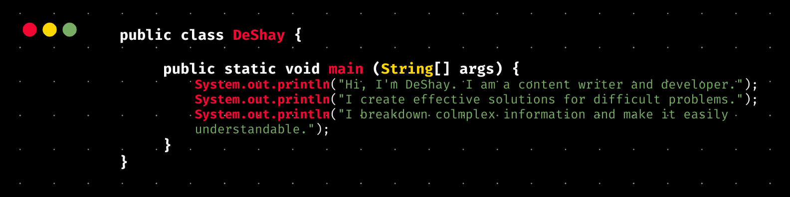

## Introduction:
<h3 align="center">
    Hi, I'm DeShay. I've been called many things over the years, but my main role is being a life-long learner.
</h3>

Soft skills of an educator, technical knowledge of an IT professional.

I have been making my official transition into the world of tech since 2020 but I have been designing and developing websites since 2015. One of my biggest goals in 2022 is to bet hired by a great company to build solutions that help make people's lives easier.

I am passionate about knoweldge being accessible and equitable for all, one of my goals includes creating and working for programs whose mission is to help people from non-technical and marginalized backgrounds gain technical skills for free.

## Quick Points:
😊 Pronouns: She/Her/They

🔭 I’m currently working on my Associates of Applied Science in Computer Programming with a focus in Application Development - Cloud Computing

✍🏽 January 2022 Study Focus: Microsoft Certified: Azure Fundamentals and Smart Contract Development (Solidity)

💬 Ask me about: my tech journey, my favorite anime, or my latest project (Konnect).

👯 I’m looking to contribute to open source projects

🧑🏾‍🏫 Fun fact: One of my most memorable professional experiences incldues teaching over 200 wonderful ESL learners at a university in Northen China. My Chinese pronunciation isn't that great but that's what hours of practicing on Rosetta Stone is for.

## I’m currently learning 

- App Development 👩🏾‍💻
- Blockchain & Smart Contracts ⛓
- Cloud Computing ☁️

## Technologies: 
### Cloud Computing: 

 

### Content Creation
Did you know that I went to the 2016 Democratic National Convention as journalist? 

### Development 

### Operating Systems

